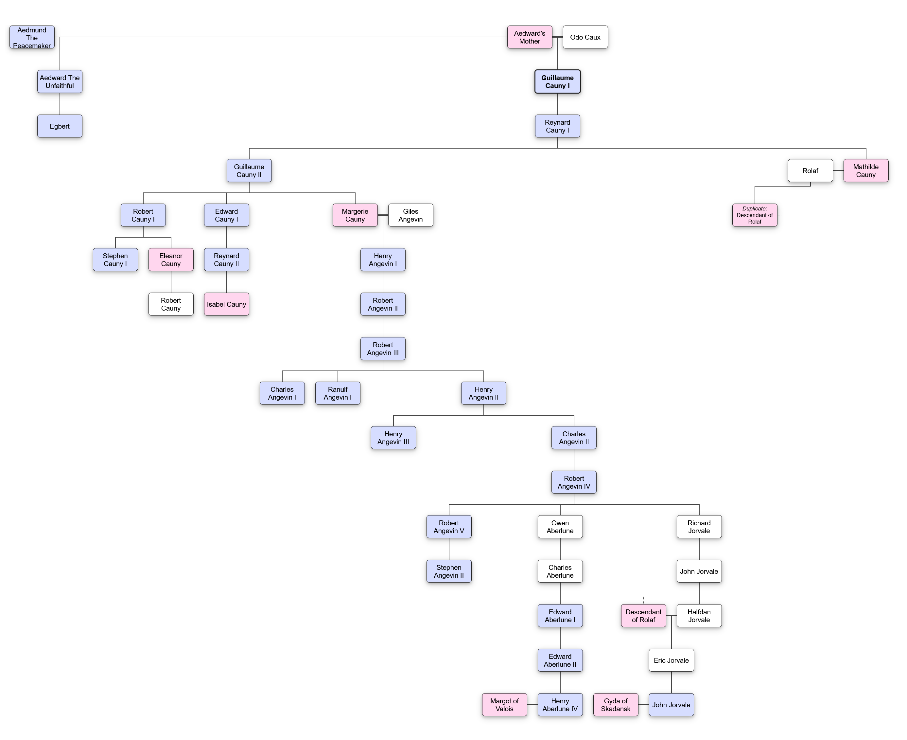

::: {.text-center}
# O Varium Fortune

*O varium fortune lubricum*  
*Dans dubium tribunal iudicum*  
*Non modicum paras huic premium*  
*Quem colere tua vult gratia*  

*Et petere rote sublimia*  
*Dans dubia tamen, prepostere*  
*De stercore pauperem erigens*  
*De rhetore consulem eligens*
:::

## A History of Albany (c.40 - 1417 AN)

[{width=250px style="display:block;margin-left:0"}](Map of Albany.png)

### Lazioni Albany (c. 40 AN)

In the days of Emperor Vispario the Lazioni Empire settled and subdued the Gallic tribes across the entire island, stopping short of Cledonnia. With them they brought manuscript, roads, and later the triune Nazarene faith. Lazio rule endured for centuries until the Sacking of Lazio c. 400AN.

### The Old Kingdoms (c. 400-900 AN)

The era of the Old Kingdoms was largely a time of great strife and conflict. Albany was divided into four Kingdoms as follows.

#### Pictony
in the Pictish tongue "Alba". Traditional arms are a white highland stag on a blue field. 

The realm of Pictony, to the North and North-West, were assorted clans and kinsmen of Cledonnic stock. Having never submitted to Lazio rule they were a proud people. Although many clans swore oaths to the Pictish Laird Chief, an elected King, many of the northernmost highlanders remained independent and do so to this day.

#### Brydony
in the Brydon tongue "Brydain". Traditional arms are a red dragon, the Lazio battle standard, on a green field. 

The petty kingdoms of Brydony saw themselves as heirs to both Lazio and the Gallic tribes, and view their history as an unbroken heritage of those days. Centuries of infighting and invasion eroded that claim however, and by the end of the age of the Old Kingdoms Brydony only claimed dominion over the West and South-West of Albany.

#### Saesony
in the Saes tongue "Saesia". Traditional arms are a blue lion on a white field, the personal arms of Aedward the Great. 

The Saes were originally strong adventurer peoples hailing from the Saesonland region of Hermania. In the centuries prior to The Old Kingdoms they conquered much of the South-East, and established long-standing petty Kingdoms. Infighting slowed their progress across the land but in turn established a true Saes king in Aedward the Great, also known as Aedward the Lion.

#### Norskany
in the Old Norsk tongue "Dansklaw. Traditional arms are a grey wolf, symbol of the heathen god Vodinn, on a black field. 

Folklore has it that the Svene the Bloody set sail to Albany as an exile from the Kingdom of Skadansk, and was slain whilst raiding the Isle of Aida. His sons Haakon Shieldsbane and Erik Fairhair returned to Albany to avenge him, and together they conquered the entire North-East, a region still known today locally as Dansklaw.

### The Quadrarchy (c. 957-1054 AN)

After years of costly and ineffective wars the nobles of The Old Kingdoms had grown tired, but also fearful of foreign powers. The rulers of the four Kingdoms met together to discuss the possibility of a peaceful agreement to bind them together without bloodshed.

Chief Domnall Mac Rath of Pictony, Gudrod Hunter-King of Norskany, Aedmund the Peacemaker of Saesony, and Hywel Mawr of Brydony agreed a treaty that ensured two things. Firstly that no Kingdom may involve itself with the affairs of another, and secondly that all Kingdoms shall come to the brotherly aid of another should a foreign army invade.

This agreement led to almost a century of peace, known as the Quadrarchy, the Rule of Four.

### The Great Crisis of Saesony and Norchois Invasion (c. 1055-1057 AN)

Following the death of Aedmund's successor, Aedward the Unfaithful, his grandson Egbert took the throne only to pass without issue a year later. This left no clear successor to the throne of Saesony, as Egbert was Aedward's only legitimate son, although Aedward's many bastards remained. Two such sons, Aethelred Forkbeard and Aedgar the Bastard, rose their banners and went to war. The other Kingdoms, honouring the Quadrarchy, did nothing to intervene. It was this inaction, and a Saesony weakened by civl war, that ultimately allowed the end of the Old Kingdoms.

Duke Guillaume of Cauny was Aedward's half-brother, raised in the Norchois duchy of Cauny on the north coast of what is now now the Kingdom of Valois. Through legitimisation by his father, the Duke Odo Caux, he claimed descent from Rolande, the Old Norsk noble and first Duke of Cauny. When took reign of the Duchy upon Odo's death with little pomp or ceremony he earned the title "The Unsung", for not even the King of Valois attended his feast. Upon hearing of the Great Crisis of Saesony, and still discontented with his low reputation, he claimed indirect descent from Aedward the Lion along his mother's line and set sail his fleet to Albany.

By the time Guillaume's army landed on the south coast of Saesony, Aethelred had already defeated his half-brother decisively in battle, with Aedgar captured and imprisoned. He had no time to rest however, as the Norchois army had already ravaged the countryside and left him no choice but to immediately march south without waiting for the other Quadrarchs to send help.

On the fields of Haesta the two armies clashed and, according to folklore, Guillaume slew Aethelred with a single arrow, piercing his eye. Defeated, the Saes army had no choice but to swear fealty to their conqueror. Knowing that the other three Kingdoms could retaliate at any moment, Guillaume set to work fortifying his new territory and called upon his remaining bannermen in Cauny to his aid. By the following spring he had begun to range into Brydony, supported by his bannermen who had landed on the South-Western coast. At the peril of being razed by the Norchois many Brydon nobles broke fealty to King Owain ap Rhys and instead brokered peace with the invaders.

By the end of the year forces from Norskany were bearing down on occupied Saesony, but the Saes nobility loyal to Guillaume insisted that he was not a foreign invader but the rightful King of Saesony. Taking the invasion of Brydony as evidence that Saesony had broken from the Quadrarchy, the Norsk laid siege to the Duke's now fortified cities. Rather than arrive himself to break the sieges, Guillaume sent his newly loyal Brydon vassals in his stead, whilst his army marched north to strike at the Norsk homelands.

Following a series of brutal harrying across the north to bait the Dansklaw banners away from Saesony, Guillaume and his generals overwintered in Norskany whilst King Erik Ironside fled back to stop the Norchois campaign of ravaging. At the battle of Leirford the Duke defeated the exhausted Ironside's army, but not without suffering heavy losses from the fearsome Norsk warriors. King Erik himself met his end at the battle, and afterwards many of his vassals swore loyalty to the Unsung.

Upon hearing of the victories of the invader, Laird Chief Giric Mac Dhugall of Pictony, known after as the Craven, saw no reason to try and fight a losing war. He parleyed with Guillaume and without hesitation pledged his banners to the new ruler. Many Pictish kinsmen were distasteful of Giric's surrender and declared themselves independent clans, denying Guillaume dominion over the highlands as Vispario was denied Cledonnia before him.

Nevertheless Guillaume was crowned King of Albany in the palace of Greatminster in 1057 to great fanfare, and thus began the era of Norchois rule, with Guillaume founding the House of Cauny. Fearing the might of a united Albany, Robert the Bald of Valois ordered Guillaume to be stripped of his ducal title and Cauny was absorbed into Valois. As the Unsung was too preoccupied with his new Kingdom to retaliate it was a bloodless retraction, and Guillaume would never see his home again. Over the next decades wars of consolidation and rebellion would break out, and it would not be until the reign of Guillaume's son, Reynard, that all of Brydony and Norskany would fall under Norchois rule. The far highlands of Pictony remained independent as they do to this day.

### The House of Cauny (c. 1057-1179AN)

What follows is a brief annal of the Kings of Albany of the House of Cauny.

#### Guillaume I the Unsung (r. 1057-1076 AN). 
Conquered the Old Kingdoms and overthrew the Quadrarchy.

#### Reynard I (r. 1076-1089 AN). 
Eldest son of Guillaume I. Completed the Norchois conquest of Albany with protracted campaigns in Brydony and Norskany. Rebellious Norskany was quelled only by the marriage of his daughter Mathilde to the Norsk heir Rolaf.

#### Guillaume II the Old (r. 1089-1124 AN). 
Eldest son of Reynard I. His early rule saw many raids by seamen from Skadansk as well as Brydon rebellions. However his victories on the field brought in a relatively long era of peace and an extended reign.

#### Robert I the Reformer (r. 1124-1142 AN). 
Eldest son of Guillaume II. Put down the Elector's Rebellion in Pictony, which sought to enforce the Pictish succession laws upon Albany. Sensitive to the bickering cultures of Albany he reformed lawmaking and begun the development of what we now know and speak as common Saeson tongue.

#### Stephen I (r.1142-1143 AN). 
Eldest son of Robert I. Developed consumption immediately after his coronation and died without issue after just a year of rule. A month of storms preceded his passing, widely regarded as a sign from the Gods of his unworthiness. Mass rebellions arose in Brydony midway through his short rule.

#### Edward I the Ironhanded (r. 1143-1165 AN). 
Youngest son of Guillaume II. Crowned following his nephew's disastrous reign by agreement at the Council of Rivenhall. Remembered primarily for his subjugation of the Brydon rebellions. After executing the rebel leaders he granted their titles and holdings to loyal Saes instead.

#### Reynard the Affable II (r.1165-1179 AN). 
Eldest son of Edward I. Largely known for a relatively peaceful reign. He reformed county borders to prevent the squabbling of his vassals, and levy laws to circumvent peasant uprisings. The end of his rule was marred by the death of his heir Rolande during a hunting accident, shortly followed by his own passing. With that House of Cauny became extinct.

### The Unrest (c.1179-1181 AN)

After the death of his son Reynard had named his cousin Robert the Lesser, a son of Robert I's daughter Eleanor, as heir apparent. However on his deathbed he had a change of heart and named his own daughter Isabel instead. Robert the Lesser immediately crowned himself king, but lords loyal to Eleanor rose their levies and marched on Greatminster. Civil conflict spread across the country, but neither Eleanor nor Robert had the stomach for protracted war. At the Council of Uxbridge they agreed to both cede the throne in favour of Henry of Angevingia, a descendant of Guillaume II's daughter Margerie's marriage to Gilles the Valois Duke of Angevingia. Henry accepted the crown and sailed from Valois in 1181 to establish the House of Angevingia.

### The House of Angevingia (c.1181-1345 AN)

What follows is a brief annal of the Kings of Albany of the House of Angevingia.

#### Henry I (r.1181-1199 AN). 
Son of Gilles II of Angevingia. Ceased his war to claim Cauny to take the throne of Albany. Henry immediately set to work reforming the law regarding feudal obligations to bring Albany's customs in line with the Kingdoms on the continent. Although many Brydon and Pictish lords postured about opposing him, he never saw any uprising against his rule.

#### Robert II (r.1199-1209 AN). 
Eldest son of Henry I. Announced his intentions to invade and reclaim Cauny upon ascension. Duke Einar of Jorvale vocally opposed the idea of foreign affairs and threatened rebellion. Robert began his war across the Jerrais Channel in Cauny, but Einar refused to send troops. Robert died in battle and was entombed back in Angevingia.

#### Robert III the Fortunate (r.1209-1230 AN). 
Eldest son of Robert II. Remembered as shrewder ruler than his father. Successfully occupied Cauny and granted mercy to its ruler Stefan Caux. In 1226 he announced the inheritance of Gilles II's claim to the Valois crown, beginning the Long War against King Ranulf of Valois.

#### Charles I (r.1230-1244 AN). 
Eldest son of Robert III. Ruled mostly from war camps. The campaigns in Valois preoccupied almost his entire rule. In his stead Curtis the Duke of Uxbridge was appointed to manage affairs in Albany. Died of an arbalest's bolt in 1244.

#### Ranulf I the Unready (r.1244-1257 AN). 
Second son of Robert III. Failed to consolidate the successes of his elder brother's campaigns and lost much territory overseas. Returned to Albany at the behest of Uxbridge to settle the disputes of Duke Harald of Jorvale, who was unhappy with his levies being overseas for years. In all but title Harald commanded every Norsk noble. Fearing rebellion, Ranulf made the perilous decision to allow Jorvale's troops leave to return home. Died of extreme stress only a few years later.

#### Henry II (r.1257-1271 AN). 
Youngest son of Robert III. Desperate to not let his father's war be lost, he threatened to strip Harald of his titles unless he returned Jorvale's levies to Valois. Harald petitioned his kinsman Tryggvi, King of Skadansk and declared independence. Henry put down the rebellion at great cost, but was unable to stop the Skadansk invasion of his holdings in Cauny.

#### Henry III (r.1271-1289 AN). 
Eldest son of Henry II. Laborious peace talks with Skadansk and Jorvale marked the start of his rule. After recapturing Cauny and stripping Harald of his titles, Henry reformed Alban law to forbid any one noble holding power, ceremonial or otherwise, over multiple duchies again.

#### Charles II the Temperate (r.1289-1313 AN). 
Second son of Henry II. Remembered as a more measured ruler than his father or brother. His rule was notable for good stewardship and a fasterntide visit from Pontiff Rosario. Under his marshalls Albany made good progress in the Long War.

#### Robert IV the Disgraced (r.1313-1335 AN). 
Eldest son of Charles II. Ultimately lost the Long War, ceding both Cauny and Angevingia to Valois. Spent the remainder of his rule attempting to restore prosperity to the Kingdom, with mixed fortune. His rule also saw The Great Turning, whereby many Pictish lords turned over from Alban rule to the independent realms of Pictony.

#### Robert V (r.1335-1352 AN). 
Eldest son of Robert IV. Alongside King Luis of Valois and Emperor Conrad of Hermania, answered the call to arms of the Holy Sees to seize the Holy City of Urashala from the heathen Moros occupiers. During this campaign he founded the Knightly Order of the of the Veil, inducting into it his closest family and companions. The costly war ultimately failed, and Albany refrained from joining future crusades.

#### Stephen II (r.1352-1376 AN). 
Eldest son of Robert V. Last Angevingian King of Albany. Led a failed invasion of Galliway in an attempt to extort funds for the Kingdom's depleted coffers. His ship sank in the Gallic sea in a storm on the return voyage, drowning him, his advisors, and his entire family who had accompanied him, leaving Albany with no clear heir.

### The Cadet Houses (c.1330 AN onwards)

During Robert IV's reign his sons established cadet branches of the House of Angevingia. After Henry III's reforms certain Ducal titles were returned to the crown upon death rather than passed down via hereditary laws. Whilst Charles II appointed trusted nobles with the titles, Robert IV kept many in the family. His second son Owen was well loved as the Duke of Aberlune, and his third son Richard was gifted the title of Duke of Jorvale. These in time grew into their own Houses.

After the death of Stephen II, the lords of Albany were largely in agreement that the House of Aberlune as the senior branch had the strongest claim, and so Edward of Aberlune was selected as heir at the Council of Soarcester.

### The House of Aberlune (c.1376-1412)

What follows is brief annal of the Kings of Albany of the House of Aberlune.

#### Edward I (r.1376-1390 AN). 
Grandson of Owen Angevingia. Popular and well beloved. Afforded many liberties to his vassals and won great favours at court. Resumed the Long War against Valois, scoring an immediate and critical decisive victory at the Battle of Tramecourt. Died in the subsequent Battle of Cadon, which was yet still won by Alban forces.

#### Edward II Greymantle (r.1390-1412 AN). 
Eldest Son of Edward I. Won the Long War, bringing Cauny and Angevingia back into possession of the crown and ensured peace by marrying his son Henry to the Valois princess Margot. Appointed his beloved friend and Royal Chamberlain William Duke of Waerick to Regent after falling ill. Coastal raids by Skadan and Galliwayan bands precipitated Pictish and Brydon revolts over the dereliction of the crown in its duty to protect them. Edward passed before the matter could be resolved.

[{width=250px style="display:block;margin-left:0"}](AlbanyRoyalTree.png)

### The Outlaw King and the prelude to the Wars of the Veil (c. 1412-1417 AN)

After the death of Edward II his son Henry IV took the throne. Henry immediately appointed Duke John of Jorvale as Royal Chamberlain. John was a cousin to Henry, and head of the House of Jorvale. They had been educated together in Waerick at the court of Duke William alongside William's son Christopher, and were like brothers. Both too were proud members of the Order of the Veil.

Whilst Henry saw to resolving peace with Galliway, he appointed John to do the same with Skadansk. John surprised the King by returning in 1413 with a Skadan noblewoman as a betrothed and the matter resolved. Henry demonstrated his gratitude by hosting the wedding at the Palace of Northome to great fanfare. That winter Henry took ill with the same dystrophy that took his father, and appointed John to run the Kingdom.

With Henry too feeble to even hold court, John was effectively king in all but name. Through campaign and diplomacy he quelled all of the uprisings in Pictony and Brydony, offering up grain tithes to the affected counties as a gesture of goodwill. He also saw to it that in the following winters, after pitiful harvests and bad seasons, the crown would cover the cost of grain to cover any deficits in food.

Both noble and peasant alike held John in high regard, which began to disquiet the Queen Margot. She began to view his efforts as a deliberate attempt to usurp her husband's title and authority, fearing with John on the throne her marriage no longer secured peace between Albany and Valois. In secret she conspired to accuse John of treason, and gathered what allies she could.

In his weak-minded state Henry passively agreed to sign a warrant declaring that John had caused the King's affliction by poisoning Henry and had intention to declare for the throne upon his death. John was hurt by this betrayal of his oldest friend, and was forced to flee the country to escape arrest in the autumn of 1415.

Miraculously in 1416 Henry recovered from his condition, a sign by many that the Gods blessed his rule. With little memory of the past three years he was shocked by the supposed crimes of John, and congratulated Margot on preserving the realm, who in turn steeled the King for a potential invasion by John. The lords of Albany were fiercely divided over the matter, some were ingratiated or indebted to John and would not believe he was capable of treachery. Others shared the King's shock at such betrayal, whilst others still deliberated on the affair intensely.

In Skadansk, John initially resolved to simply join the court of his wife Gyda's father, Jarl Erik White-Wolf. Erik was the son of King Haakon White-Wolf, and so a life at court would likely have been a comfortable one. However Gyda persuaded him that he had many supporters back overseas who would gladly support a war to clear his name, and given that it was John who had ruled for most of Henry's reign many would welcome him as King too.

In 1417, ahead of a small Skadan fleet, John made landfall in Skardaborough and immediately ordered his loyal banners to his side, declaring the House of Jorvale as the true heirs to the throne and that he, The Outlaw King, is the rightful ruler of Albany.

The ensuing wars would consume Albany on a scale not seen since the days of the Norchois Conquest. Amongst the high lords it would be known simply as "The Civil War", but, owing to the membership of both Kings in the Order of the Veil and the involvement of both Kings' wives, among the lesser nobility and peasantry it would be known as the "Wars of the Veil".

## Religion and Culture in The Kingdom of Albany c.1400 AN

### Faith

#### Nazarene Faith

The faith of the Alban isles since the time of Lazioni Albany is of course that of the Nazarene Church, the very calendar observed across Albany and the continent is dated to the birth of the Nazarene.

The Church asserts that the Nazarene was the Incarnate, one of the three persons or aspects of the Trinity or True God alongside the Creator and the Animus, sent to Earth to reunify God and Man. It also teaches that the Nazarene was executed outside the city of Urashala in Palesheth by the Lazio Empire in 33 AN before rising from the dead as a demonstration of the eternal life the Trinity has promised to all creation.

The Nazarene's preachings, recorded in the Gospels and assembled into the Holy Scripture at the Council of Ancore c.325 AN, teach humility, repentance, and love above all. Adherents to the faith believe that these values can transform the soul into the likeness of the Trinity, and thus make it welcomed into the eternal afterlife.

The Church is hierarchical, with priests loyal to a local bishop, who in turn answer to archbishops, who in turn answer to one of the Holy Sees, known also as the Patriarchs or Popes.

The True God can be referred to as singular, or in plural as Gods referring to the Trinity.

#### Nazarene Syncretism

The adherents of the Nazarene faith believe it to be the successor and fulfilment of the Semaic faith observed in the Holy Land centuries before the birth of the Nazarene. Before it was unexpectedly adopted as the state faith of the Lazio Empire by Emperor Eustazio, it spread across the world by missionaries.

Just as in the east it was syncretised with the Semaic temple beliefs, in the west it was syncretised with the myriad heathen faiths.

In Lazio the palace deities of Deuspeter, Diovona, and Meneva were equated as the indirect revelations of the True God in Trinity form. Similarly the later Norsk church equated Vodinn, Frey, and Thunor, whilst Bredon missionaries saw the Trinity as the successor to the triune Matres, or the common Gallic pantheon of Toranis, Karnon, and Brigit.

Alongside local belief it was not uncommon for local ritual to be subsumed into the new faith, albeit this was eventually replaced by codified prayer and services. By the C10th AN most churches had adopted the modern canonical practices. Whilst the Patriarchs called councils over the centuries to establish standard church canon and practice, these syncretic rituals would still see use in certain parts of Albany, specifically in the north among Pictish and Norsk populaces. Examples include outdoors worship and bog sacrifice of valued possessions.

#### Faith in Court 

As befitting any faithful noble, court business across Albany seeks to be pleasing to the True God foremost, at least in principle if not in action. Court chaplains advise and pray for those in power, and the nobility often seek to find divine justification for their actions. The fortune of individuals often is viewed as a measure for how pleasing they are to the Gods. For example Guillaume the Unsung is considered blessed by the Gods with his successful conquest, in contrast to King Stephen I whose cursed reign was viewed as displeasing to the Trinity.

#### Old Ways 

Although no noble in Albany rejects the teachings of Nazarene, it is not unheard of that independent Pictish clans in the far north still practice the ancient Gallic faith, known to some as the Old Ways. These ancient beliefs are said to pre-date the Lazio occupation, and are myriad and multifaceted in nature. Luck charms, seasonal sacrifices, and a belief in an otherworld are common themes, although local belief often varies place to place. It would be difficult or perhaps impossible to codify every local belief of the heathen Pictish, and the boundary between faith and folklore often times is equally difficult to discern.

### Culture

#### Culture in Albany

In the centuries since the Norchois conquest the four cultures of Albany have become more uniform under Cauny and Angevingian rule. Robert the Reformer's mission to create a common tongue has largely come to pass, with common Saeson being the standard spoken language across the land, with legal texts written in Lazioni. The exception to this is in Brydain, where the Brydon tongue persists as the common language. Local vernacular persists outside of Saesony however, with many lesser nobles and serfs speaking exclusively in their provincial manner.

The influence of the Norchois and later Angevingian monarchs on the nobility of the land can be heard more than seen, with the High Saeson used in courts having many loan words and phrases from the continent. Because of the Norchois hegemony it's not uncommon for Valois culture to be seen as more kingly than the Alban cultures, although each in their own way have adopted aspects of Norchois culture.

#### Saesony

The seat of Greatminster the capital city of Albany, the first of the four Old Kingdoms to accept the Guillaume Caux as King, and the root of modern Saeson. It is easy to see why Saes often view themselves as exceptional, and why the people in the Saes counties view their ways as the de-facto Alban way. However, moreso than the other three Old Kingdoms, Saesony took on many Norchois customs and linguistics under the House of Cauny. Customs and fashions from the continent, be they from Valois or Hermania, often found their way to Saesony first, giving the culture a sense of royal privilege. Indeed, kinship ties the Saes of Saesony to the Saes of Saesonland in Hermania from which the Saes people originated. It is not uncommon for Saes nobleness to be discussed, as opposed to the uncivil north and west. This divide is echoed in those provinces, where the Saes are oft talked about as turncoats who betrayed the Quadrarchy. Old grudges run deep, but the Saes cover them over with continental gold and Norchois opulence.

#### Brydain

The western reaches are viewed as a backwater by other cultures, a relic of an era long gone at best and a deluded people living in the past at worst. The Brydon people are not fiercely proud in the same way as the Pictish or Norsk, but rather they hold a stoic pride. For them they are the last vestige of Lazioni Albany, protectors and stewards of ancient kingdoms left to them for a millennia now. It is rare for any Brydon to use the Saeson language as their primary tongue, instead it is used almost solely to converse with outsiders. All Brydon, common and noble alike, speak old Brydon. The handful of Norchois lords installed during the Conquest may speak Saeson in their estates, but the Norchois attempts to convert the populace from their Brydon roots failed miserably. Norchois culture did not take ahold despite its associated prestige, for Brydain claims its own prestige in the Dragon Banner of old, holding onto language and customs from the most powerful Empire in history. For this reason even the poorest Brydon lord takes pride in his holdings. Perhaps the greatest effect the Norchois had on the region was the Brydon strengthening their culture in response to their attempts to integrate them.

#### Dansklaw

As the last of the Old Kingdoms to be founded, the Norsk people are perhaps the most foreign of all the cultures of Albany. Their emphasis on kin, hospitality, and martial justice sets them at odds with the southern Saes ideals of nobility, sophistication, and courtly ideals. That is not to say the Norsk do not value prosperity, however. Despite the varied quality of farmlands in the Dankslaw their historic mastery of sailing means they command the greatest fishing and overseas trading economy of any of the Old Kingdoms. Norchois influence is almost impossible to find in Dansklaw, unsurprising as it was also the last Kingdom to submit to Cauny rule, doing so only after a marriage of allegiance. Saeson is spoken amongst both the lord and serfs, albeit peppered with Old Norsk words and phrases. The perceived separation from the rest of Albany has meant many generations of Norsk nobles have felt comfortable to disregard royal decree, sometimes to their great downfall. Historic ties with the maritime empire of Skadansk also affords many Dansklaw lords with allies abroad.

#### Alba

The Pictish by far have the most complicated relationship with the rest of Albany. Formed of the clans that the Lazioni could never conquer, they avoided becoming Brydon. However the Alban Pictish later kneeled to the Norchois, barring those who would form the Independent Clans. They would prosper as part of Albany until the Great Turning in 1336 AN during Robert the Disgraced's rule, where numerous clans declared themselves independent. It is important to note this free-flowing clan loyalty, because it partly defines the Pictish. Until the Norchois Conquest they never truly had a unified kingdom as much as a representative chief agreed upon by the clans. Each clan will act independently in most matters, but not in the aggrieved manner of the Brydon or the upstart way of the Norsk. Rather the Pictish simply have never acknowledged central authority in the same way. Whilst the Brydon view themselves as heirs to an ancient culture, the Pictish simply live the reality that their Gallic ancestors did without the same level of ceremony. As such each clan may or may not have adopted some foreign customs depending on their own local opinion. The one unifying aspect of Pictish culture is there is no unifying aspect of Pictish culture. Beyond a shared Pictish dialect the clans are as varied as the holdings they inhabit.

## Realms Overseas

#### A brief history of Valois and Hermania

After the fall of the Lazioni Empire a power vacuum emerged. Centuries later in 784 AN Theuderic Marteau established a confederacy of Franciscan kingdoms, called Martevingia, and was anointed by Pontiff Leonardo as the Emperor of Lazio. After the death of his grandson and successor, Hugues le Magnifique, it was split between Hugues' sons into three realms: Angevingia, Liguringia, and Tungringia.

In the following century the three successor states became fractious. Eventually King Roland of Liguringia passed without issue, and so King Bruno I of Angevingia inherited the northern half of Liguringia while King Arnulf of Tungringia inherited the southern half.

King Bruno's descendant, Luis le Fort consolidated his holdings into the Kingdom of Valois in 937 AN, codifying law, currency, and language.

Tungringia, whilst never reaching the full heights of power of Martevingia, continually grew as inheritances and annexations brought more lands under the rule of one crown. After King Rudolf I acquired the crown of the Kingdom of Vitalus, and then repelled a Yugra invasion, he was anointed Emperor of Lazio by Pontiff Giovanni XI, the first since Theuderic. He formalised the Empire into the Empire of Hermania, creating an elective succession and a more stable realm.

### Kingdom of Valois
Formerly Angevingia and Liguringia. Over the centuries has traded control of Cauny and Angevingia with the Kingdom of Albany. Its remaining holdings are mostly the traditional territories of Liguringia, in addition to the Brydon-cultured Gallois. At present the Kingdom is at peace with its longtime enemy Albany, sealed with a political marriage. Currently ruled by King Luis X.

### Empire of Hermania
Formerly Tungringia. King Rudolf I through diplomacy and conflict united Tungringia, Vitalus, Saesonland, Zeelandia, and Alamannia, creating the modern core of the Empire. The Empire was blessed by Pontiff Giovanni XI and is considered to be the true successor to the Lazioni Empire. Over the centuries smaller holdings have been absorbed into Hermania. The Empire is Elective, with all Prince-Electors having a ballot upon the death of the previous Emperor. Currently ruled by Emperor Sigmund.

### Emirate of Qurtubah
A complex multi-cultural empire spanning the Thurvingian Peninsula and part of north Ifran. Established when Attareq, the Moros commander of Ifran, came to the aid of Thurvingian rulers who were in open rebellion against their king Ludaric, an infamous defiler. Unlike Moros kingdoms of the east Qurtubah has enjoyed a long and stable existence, becoming a hub for intellectuals and inventors. Moros, Nezarene, and Semaic rulers and subjects live with minimal friction, although matters of succession are oft much more complicated than in other western realms. Currently ruled by Emir Abd al-Rahman VI.

### Grand Kingdom of Livonia
Founded as a personal union of the Duchy of Kernavia and Lechia, the Grand Kingdom is one of the largest realms east of Lygos. In 1385 AN, under military threat from Hermania from the west the Duke Wladyslaw of Kernavia married Queen Hedwig of Lechia, creating a formidable union that defeated Hermanian knightly orders across the next few years, securing a period of peace. Whilst most subjects of the Livonian Crown are either Nazarene or Semaic, there are many practitioners of Livonian Old Ways still persisiting. Currently ruled by Queen Anna I.

### Principality of Ruthenia
Originally a conferedation of Norsk, Lechian, and Lechian trader states that capitalised on trade routes between Skadansk and Lygos. With the adoption of the Nazarene faith the Duchy gradually syntehsised Skadan and Lygosian culture. Over the next few centuries the Duchy repelled a series of invasions from the steppe nomad Khaluks, consolidating its military in time to repel a Hermanian conquest of the region. In the aftermath Prince Aleksiy Vsevolod laid out the charters to formalise centralised rule from the city of Slovensk. Currently ruled by Prince Dmitri I.

### Petty Kingdoms of Galliway
Much like in Alba, a fellow Gallic land, the Petty Kingdoms of Galloway are ruled by a myriad of independent clans. Bound together by common heritage and culture, the clans have never united into a single political entity. Many Petty Kings have attempted to unite the island, all of which ending in failure. Likewise any attempt by Norchois or Alban kings to take the island have also failed. Nonetheless the kinship and trade ties between Brydony, Pictony, and Galliway has meant various clans have played small parts in the history of Albany. There is no singular ruler of Galliway.

### Empire of Skadansk (also called Kingdom of Skadansk)
For centuries the region of Skadansk produced influential sailors and traders which spread across the seas to influence many kingdoms and empires. The three constituent Kingdoms of Skania, Svoriki and Noregi emerged c. 500-600 AN, with each one claiming dominion over Skadansk. Many Skadan rulers both in Skadansk and abroad also claimed that title, until Harald Thunderbolt of Noregi was definitively crowned King of all three Kingdoms in 1015 AN. Ruling all mainland Skadansk, as well as smaller island holdings such as Feransk and Snaeland, the Empire is second only to Hermania, and its formidable naval power gives it disproportionate reach. Currently ruled by King Magnus Haakonsson VIII.

### Empire of Lygos (also called The Lazioni Empire)
Following the sacking of Lazio in c. 400 AN by Thurvingians the Western Protectorate of the Lazioni Empire collapsed, but the Eastern Protectorate of the Empire remained untouched. From the Eastern Capital city of Lygos Imperial rule continued. Attempts to re-establish dominance through conquest of southern Vitalus were semi-successful, but over the next millennium the once great power waned. Wars with the Parthanid Empire and internal strife eroded its power, culminating in the Holy Sees declaring Martevingia and later Hermania to be the Lazioni Empire. In 1341 AN an invasion by the Khiniks, recently converted to the Moros faith, spurred the Emperor to Adronikos to petition the Holy Sees for help. A coalition of Albany, Hermania, and Valois embarked on a vast march eastward to relieve Lygos and to battle further into the Holy Land to liberate Urashala. Though they failed in taking Urashala, they did liberate much of the Imperial territory. Today its holdings are limited to Lygos proper, Epirios, Aeolios and Hattios. Currently ruled by Emperor Eustazio XII

### The City of Urashala (in the region of Palesheth)
The seat of many ancient kingdoms, many of which Semaic, the city of Urashala is most well known as the birthplace of the Nazarene faith. According to Scripture the Incarnate was executed here by the Lazioni Empire and rose again three days later. The wider region of Palesheth has seen many different rulers since then, including a shift from Lazio rule to Lygos rule, a brief Semaic rebellion, and then invasion by the Moros Caliphate of Khattabids, succeeded by the Caliphate of Umarids, then the Caliphate of Khurasids. It briefly existed as a Crusader State in 1343 AN, before being retaken by Khurasid forces two years later. Today pilgrims and subjects of all three major faiths are offered protection under Moros law. Currently ruled by Khurasid Caliph Ahmad I.

## Appendices
[📄 Coats of Arms (.docx)](Coats of Arms.docx)

[📄 Settlements of Albany (.xlsx)](Settlements of Albany.xlsx)

## Character Sheet
[📄 Albany Character Sheet (PDF)](Albany%20Character%20Sheet.pdf)
